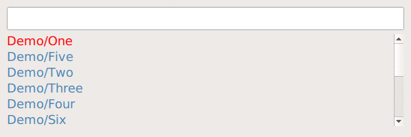
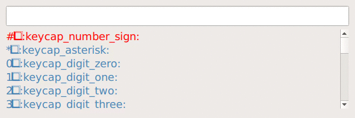

# Pext
Pext stands for **P**ython-based **ex**tendable **t**ool. It is build using
Python 3 and QML and intended to have its behaviour decided by modules.

Pext provides a simple window with a search bar, allowing modules to define
what data is shown. A module effectively defines the purpose of Pext, as shown
below.

  
*Pext running as a password manager using the
[pass](https://github.com/Pext/pext_module_pass) module*

  
*Pext running as an emoji selector using the
[emoji](https://github.com/Pext/pext_module_emoji) module*

# Usage
Note: The below commands assume you're in the root directory of this
repository. If you're not, replace "pext" with the full path of the pext
directory.

First, you will want to install one or more modules you want to use. You do
this by using the --install-module command, followed by the URL of a git
repository.

For example, to install the official
[pass module](https://github.com/Pext/pext_module_pass), run the following
command:

    python3 pext --install-module=https://github.com/Pext/pext_module_pass

For more modules, check out the
[Pext organisation on GitHub](https://github.com/Pext).

After you have installed a module you want to use, launch Pext with the
--module parameter. For example, to use the pass module, launch it as such:

    python3 pext --module=pass

You may launch Pext with multiple modules, at which point you can use Ctrl+TAB
and Ctrl+Shift+Tab to quickly switch between modules.

A module may have its own settings. For example, if a module has a setting
called binary to specify usage of a non-default binary, you can add a
--module-binary=value flag. The --module-* flags affect the last --module
before it. So, if you have a module named pass, supporting a binary flag, and
a module named todo.sh which you want to run with default settings, you can do
the following:

    python3 pext --module=pass --module-binary=mybinary --module=todo.sh

Read the module documentation for the supported flags of that specific module.

Once Pext has launched, you can use the search bar on top to search through the
module, or type a command. Once the selected entry is highlighted or you have
typed the command you want to run, press enter to select or execute it.

Aside from switching entries with the up and down arrow keys, vi-style Ctrl+K
and Ctrl+J bindings, mouse support and basic tab completion are supported.

To get the most out of Pext, set up your system to start it with a global
hotkey, so you can always quickly access it when you need it.

You can always use the `--help` flag for a list of options.

## Dependencies
### Debian (Stretch and later, no Jessie, sorry!)

    sudo apt-get install git python3 python3-pyqt5 python3-pyqt5.qtquick qml-module-qtquick-controls xclip

### Fedora

    sudo dnf install git python3 python3-qt5 qt5-qtquickcontrols xclip

## License
GPLv3+.
