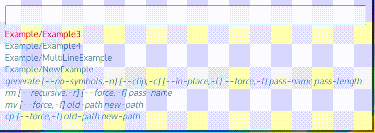

# Pext
Pext stands for **P**ython-based **ex**tendable **t**ool. It is build using
Python 3 and QML and intended to have its behaviour decided by modules.

Pext provides a simple window with a search bar, allowing modules to define
what data is shown. A module effectively defines the purpose of Pext, as shown
below.

  
*Pext running the [pass](https://github.com/Pext/pext_module_pass) and
[emoji](https://github.com/Pext/pext_module_emoji) modules*

# Installation
Pext does not need to be installed to run. However, if you prefer to install
it, you can do so:

    # pip3 install . --upgrade

# Usage
Simply start Pext with Python 3. If you have installed Pext using the above
command, simply start `pext`. Otherwise, go to the root directory and run
`python3 pext`.

To actually use Pext, you will first have to install one or more modules. Check
out the [Pext organisation on GitHub](https://github.com/Pext) for a list of
official modules.

For command line options, use `--help`.

# Hotkeys
## Entry management
- Escape: Go one level up
- Ctrl+J / Down arrow: Go one entry down
- Ctrl+H / Up arrow: Go one entry up
- Ctrl+F / Page down: Go one page down
- Ctrl+B / Page up: Go one page up
- Tab: Tab-complete the current input
- Enter: Select entry or run command

## Tab management
- Ctrl+T: Open new tab
- Ctrl+W: Close current tab
- Ctrl+Tab: Switch to next tab
- Ctrl+Shift+Tab: Switch to previous tab
- Alt+`<number>`: Switch to tab `<number>`
- F5: Reload tab, including code changes to the module

## Dependencies
### Debian (Stretch and later, no Jessie, sorry!)

    sudo apt-get install git libnotify-bin python3 python3-pyqt5 python3-pyqt5.qtquick qml-module-qtquick-controls xclip

### Fedora

    sudo dnf install git libnotify python3 python3-qt5 qt5-qtquickcontrols xclip

## License
GPLv3+.
